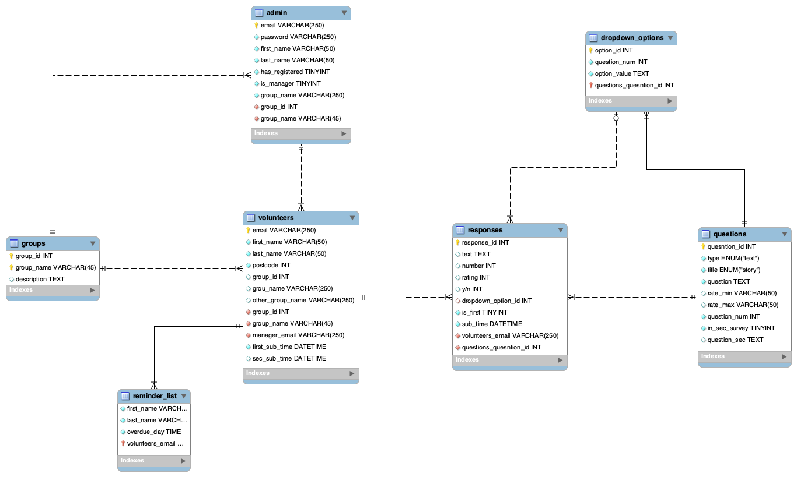

## Table of Content
* [Collective Impact Tool](#collective-impact-tool)
* [Introduction](#introduction)
* [Our team members](#our-team-members)
* [Project Background](#project-background)
* [Demo](#demo)
* [Documentation](#documentation)
* [System Requirements](#system-requirements)
* [Installation Guide](#installation-guide)
* [Changelog](#changelog)
* [Traceability Matrix](#traceability-matrix)
  

## Collective Impact Tool

Welcome to the Collective Impact Tool (CIT) Android app, developed by Team WI5DOM. This app is designed to empower users to participate in surveys and provide valuable insights over time.  

## Introduction  

The Collective Impact Tool (CIT) Android app focuses on two key aspects:  
1. **User Surveys**: This app enables users to register and participate in surveys. Users can register to participate in surveys and complete follow-up surveys after a set period.  
2. **Admin Dashboard**: The admin page provides detailed statistics on completed surveys.
   

## Our team members  

Xinyu Shi     1174419  
Yijun Guo     1255197  
Zixian Li     1240140  
Zhiyi Wang    1173477  
Jielong Zeng  1214079  

## Project Background

The product is primarily inspired by the spirit of Volunteering Victoria, embodying the mission to foster the advocacy sector and boost the volunteer community in Victoria. Aligned with this objective, the WeConnect Application for volunteers to take surveys, along with the Admin Management System for administrators to visualize survey results, have been developed.
 
WeConnect Application is designed to collect data about a volunteer’s experience, skills, and changes with three domains involving Volunteer well-being, Volunteer Confidence, and Volunteer to Job potential. To track the changes, two surveys are expected to be completed. The first survey is required to be finished at the beginning of a volunteer placement. Subsequently, there will be another follow-up survey after two months, which will be notified by reminders.
 
Admin Management System is a website to visualize and analyze survey results for administrators and managers. Different access permissions are developed to show the trends and insights of volunteers’ personal development as well as the changes across the three domains mentioned above. Therefore, administrators or managers can reflect on this quantitative data collection and support future improvements in volunteer programs.
 
With user-centric design and strategic functionalities, our product stands ready to inspire volunteer management and engagement in Victoria, inviting administrators and volunteers alike to join us in this innovative leap forward.

## Demo
### 1. Admin Website Demo

Visit our Admin Website through the [Link](https://weconnect-admin-06193c688dcf.herokuapp.com/static/login).

#### Testing Account
- **Admin account:**
  - username: weconnect@volunteeringvictoria.org.au 
  - password: adminpassword

- **Manager account:**
  - username: 123456789@gmail.com
  - password: managerpassword

#### Demo Video
<video src="https://github.com/Isabelllle/CIT-Android-team75/assets/89910392/8ea3ae38-9770-48e1-b3c0-aa7acf5f0a11" controls="controls" style="max-width: 730px;"></video>

### 2. WeConnect App Demo

Our App has an apk exported can be found [here](HandoverResource/app-debug.apk).

## Documentation
All the documentation related to the product can be found [here](HandoverResource/Documentation.pdf).

## System Requirements
### Database
The database we used is called **PgAdmin4(Version 7.6)**. The database deployed on Amazon is designed to provide a secure and stable cloud-based solution. 

Here is the account we create: 
User name: 'postgres', password:  "Qezc5566".

PgAdmin4 can be used for conveniently viewing and managing the cloud database. Below is the download link
https://www.pgadmin.org/download/

Entity-Relationship Diagram (ERD):      

The relationships between various entities can be illustrated using an Entity-Relationship Diagram (ERD).

Relationships below:       
1. Each **admin** belongs to one **group**.        
2. Each **admin** manages several **volunteers**.         
3. **Volunteers** who do not take the second survey on time will be put in the **reminder list**.      
4. **Volunteers** can **respond** to the **questions** of the survey.     
5. The survey has **dropdown questions**.
   

## Installation Guide 
### Admin Management System - Website
Steps: 
1. Clone the repository to your local computer.    
2. Start by navigating to the 'main' branch on your version control system. Make sure you're working with the latest code.  
Command for git through Terminal: 
`git checkout main`    
3. Both frontend and backend servers need to be running simultaneously.  
     **Run Frontend:**     
     Open a terminal window and navigate to the AdminWeb/front_web/admin_react directory.    
     Use the following command to start the frontend server:     
     `npm start`    
     *Note: You need to install npm before running*  
     `npm install`
            
     **Run Backend:**    
     Open a new terminal window and navigate to the AdminWeb/back_web directory.    
     Start the backend server using the following command:   
    `node app.js`      
4. Now access The Website:     
   Open a web browser and go to the address: http://localhost3001/static/login (Login Page)      

Additionally, you can access the signup page at http://localhost:3001/static/signin. 

### WeConnect Application
Steps:   
1. Clone the repository to your local computer.    
2. Start by navigating to the 'main' branch on your version control system. Make sure you're working with the latest code.   
Command for git through Terminal: 
`git checkout main`    
3. Both frontend and backend servers need to be running simultaneously.     
     **Run Frontend:**      
     Download  and open Android studio and navigate to the Weconnect/front_app directory.     
     Run the mainActivity.     
            
     **Run Backend:**      
     Open a new terminal window and navigate to the Weconnect/back_app directory.       
     Start the backend server using the following command:     
    `node app.js`
## Changelog

## Traceability Matrix
### Admin Management System - Website
| Req.ID   | Requirement Description | Justification  | Test Case ID | Test Result |
|----------|-------------------------|----------------|--------------|-------------|
| 1   | Login  | Allow account holders to log in to the system.    | LP-1 LP-2 LP-3 LP-4 LP-5 LP-6 LP-7 LP-8 | Pass |
| 2   | Edit  personal information  | Allow admin/manager to reset passwords and modify profile details    | RP-1 RP-2 RP-3 WS-1 WS-2 WS-4 | Pass |
| 3   | Sign up   | Allow manager to register an account and choose their affiliated organization.   | SU-1 SU-2 SU-3 SU-4 SU-5| Pass |
| 4   | Email varification   | Incorporate email verification during password change to ensure the uniqueness of the account.   | SU-6 | Pass |
| 5   | Admin account management   | Allow the admin to manage manager account requests and to add or remove organizations in the system.   | AM-1 AM-2 AM-3 AM-4 AM-5 AM-6 AM-7 | Pass |
| 6   | Add new survey question   | Allow the admin to add new survey questions through the system, including selecting a topic, type, and adding question content.   | MS-1 | Pass |
| 7   | Delete exist survey question   |  Allow the admin to delete the exist survey questions through the system  | MS-2 MS-3 | Pass |
| 8   | View the indicator data through a summary (graphs)   | User can easily identify trends, patterns, and anomalies within the data, revealing valuable insights   | DRA-1 | Pass |
| 9   | View the indicator data by question   | User can gain a more comprehensive understanding of the question I am interested in.   | DRA-2 | Pass |
| 10   | Filter data   | Allow users to filter data by year or organization.   | DRA-3 DRA-4 | Pass |
| 11   | Delete the survey data   | User can remove the survey has some mistakes or implausible survey.   | DRA-5 | Pass |
| 12   | See a list of volunteers who need to complete the second surveys.  |  User can know how many people are ready to have the second survey and know their details.  | RN-1 RN-2 RN-3 | Pass |
| 13   | Search the volunteer by email   | User can quickly find the specific user.   | RN-4 | Pass |
| 14   | Delete a volunteer from the list   | User can remove the volunteer who do not want further notification.   | RN-5 | Pass |
### WeConnect Application
| Req.ID   | Requirement Description | Justification  | Test Case ID | Test Result |
|----------|-------------------------|----------------|--------------|-------------|
| 1   | Navigation Bar  | Ensure users can quickly navigate to the 'About WeConnect' page/ “Contact Us" page/ "Privacy Policy" page through the navigation bar.  | NB-1 NB-2 NB-3 NB-4 | Pass |
| 2   | Fill in personal information  | User can identity themeselves in the database and receive email notifications  | PI-1 PI-2 PI-3 | Pass |
| 3   | Fill in organization detail   | User can the organization manager can view my data.   | PI-4 PI-5 PI-6 | Pass |
| 4   | Take Survey- enter the first survey  |  User can provide insights to improve the program and enhance the experience for both participants and future volunteers.  | TS-1 | Pass |
| 5   | Take Survey- enter the second survey   | User can provide insights to improve the program and enhance the experience for both participants and future volunteers.  | TS-2 | Pass
| 6   | Take survey page   | Ensure that all survey questions are displayed correctly. | TS-3 TS-4 TS-5 TS-6 TS-7 TS-8 | Pass |
| 7   | Find a Thank you/Congratulations page after completing the survey  |  User receive acknowledgement for my participation and know that the survey has been successfully submitted  | TS-9 | Pass |
| 8   | Reminder and notification system  | A reminder for volunteers to complete the second questionnaire.  | RN-1 | Pass |

